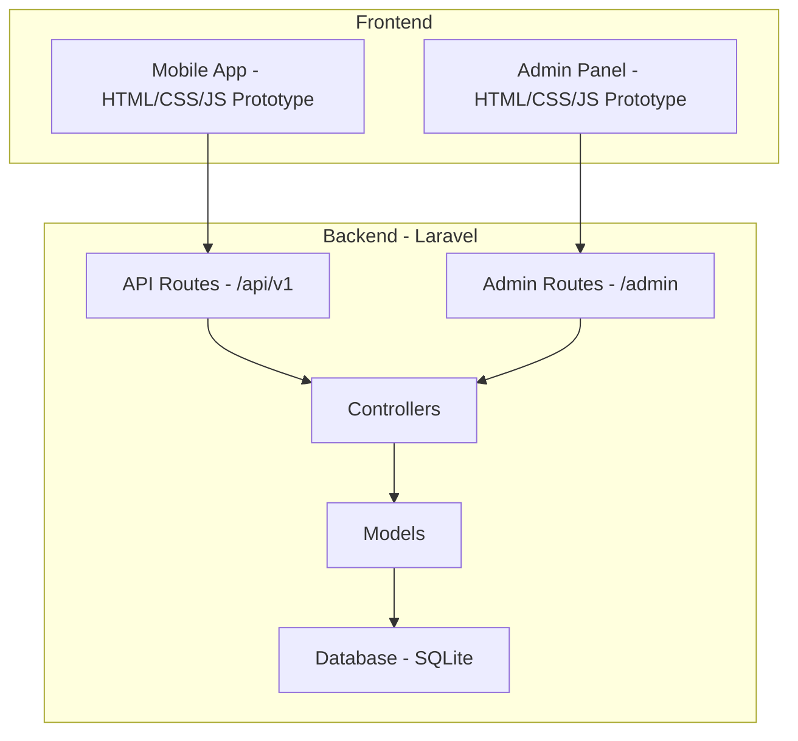
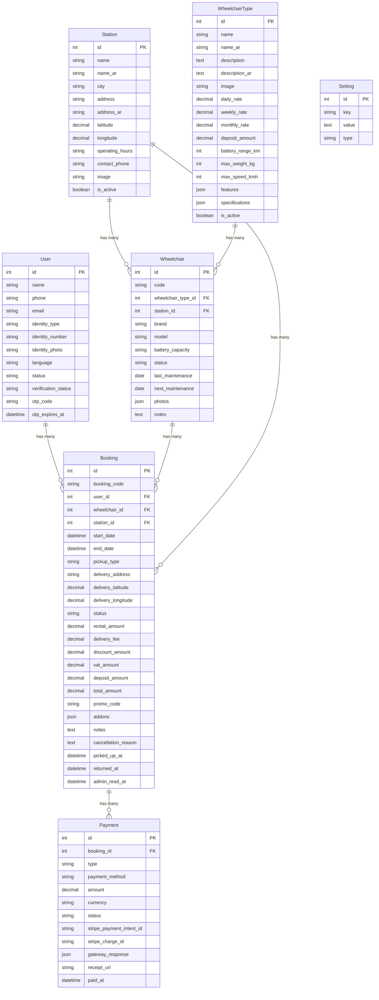
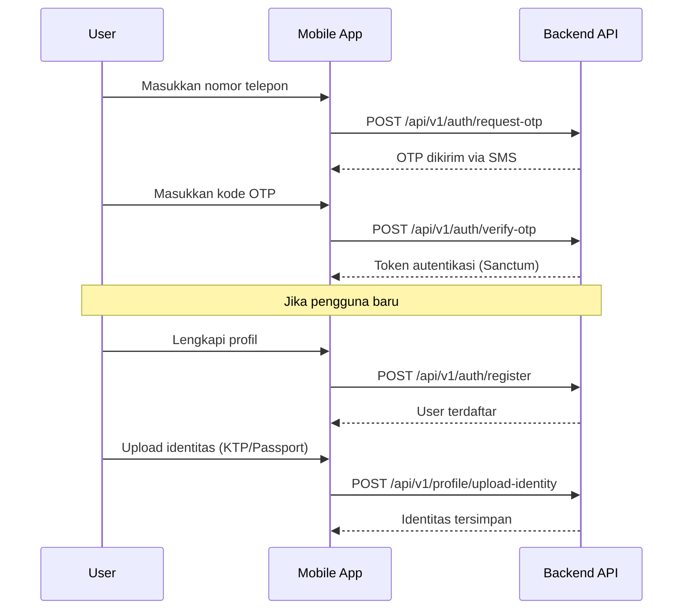
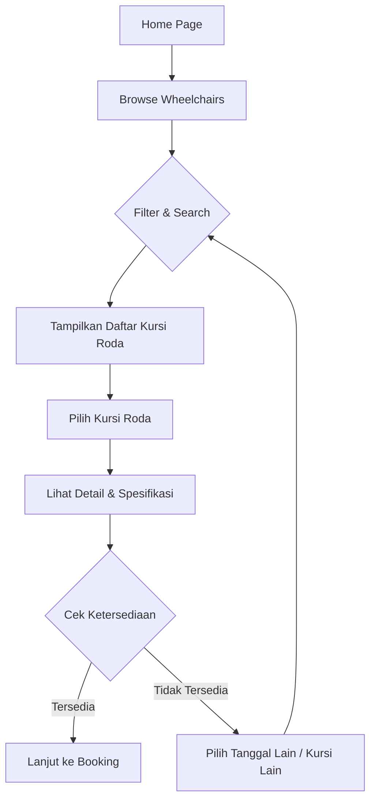
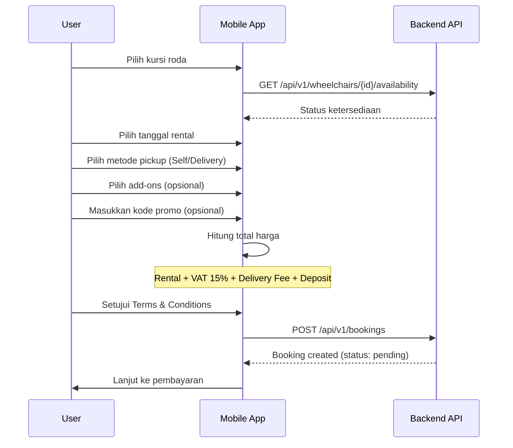
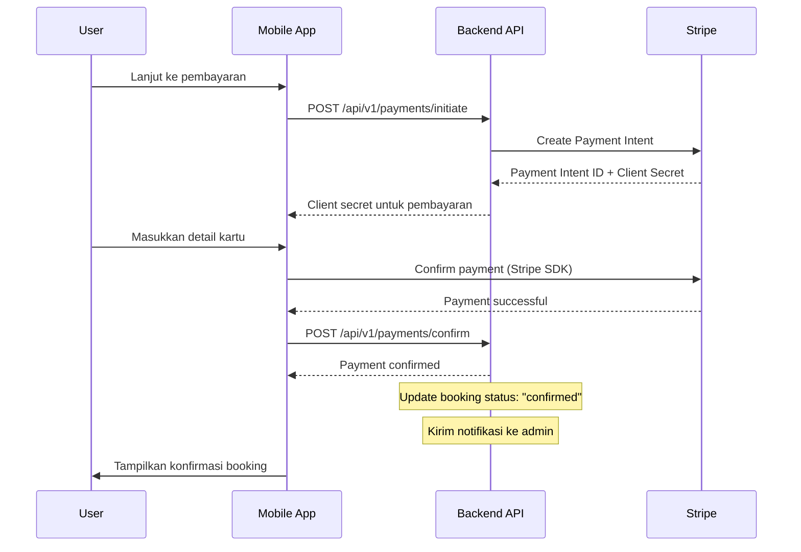
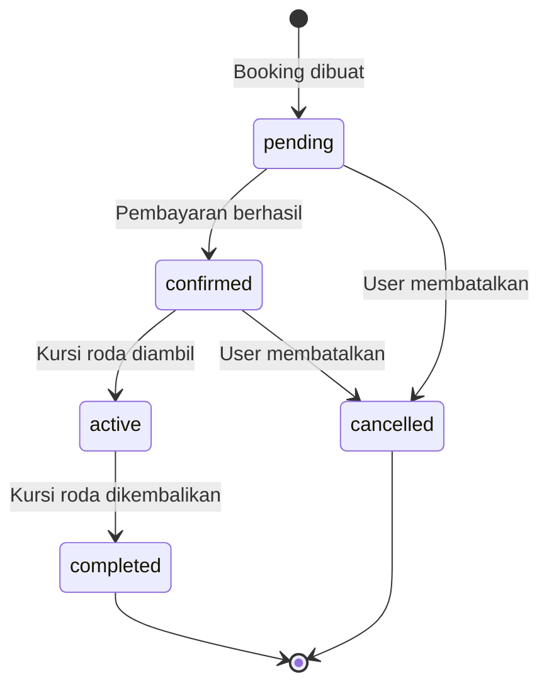
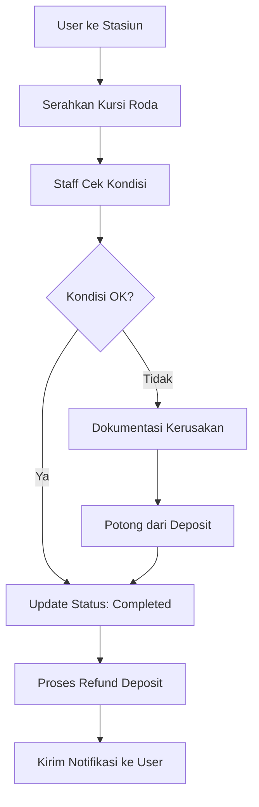
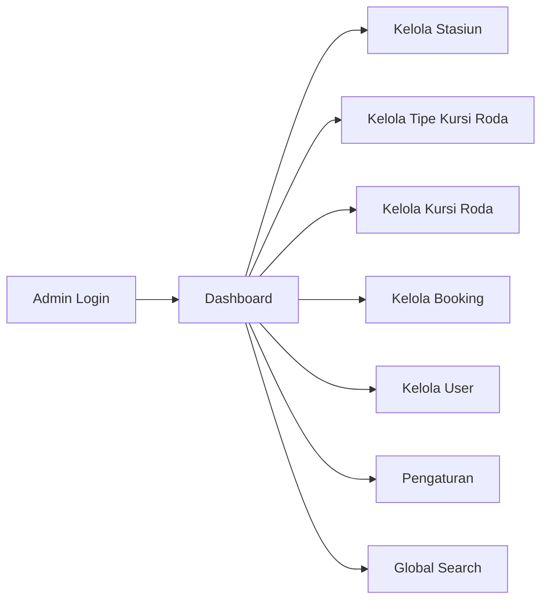

# MobilityKSA - Dokumentasi Aplikasi Rental Kursi Roda Listrik

## 📋 Ringkasan Proyek

**MobilityKSA** adalah aplikasi rental kursi roda listrik yang dirancang khusus untuk jamaah haji dan umrah di Arab Saudi. Aplikasi ini menyediakan layanan penyewaan kursi roda listrik dengan berbagai tipe dan fitur, mendukung pickup di stasiun atau pengiriman langsung ke lokasi pengguna.

---

## 🏗️ Arsitektur Sistem



---

## 📁 Struktur Direktori

```
rental-kursi-roda-listrik-saudi/
├── backend/                    # Laravel Backend
│   ├── app/
│   │   ├── Http/Controllers/
│   │   │   ├── Admin/         # Controller untuk admin panel
│   │   │   └── Api/           # Controller untuk mobile API
│   │   └── Models/            # Eloquent Models
│   ├── database/
│   │   ├── migrations/        # Database migrations
│   │   └── seeders/           # Sample data seeders
│   ├── routes/
│   │   ├── api.php            # API routes untuk mobile
│   │   └── admin.php          # Routes untuk admin panel
│   └── resources/             # Views dan assets
│
└── prototype/                  # UI Prototypes (HTML/CSS/JS)
    ├── mobile/                 # Mobile app prototype
    │   ├── home.html
    │   ├── login.html
    │   ├── register.html
    │   ├── wheelchairs.html
    │   ├── wheelchair-detail.html
    │   ├── booking.html
    │   ├── payment.html
    │   ├── bookings.html
    │   └── profile.html
    └── admin/                  # Admin panel prototype
        ├── login.html
        ├── dashboard.html
        ├── wheelchairs.html
        ├── bookings.html
        └── users.html
```

---

## 📊 Model Database (Entity Relationship)



---

## 🔄 Alur Aplikasi

### 1. Alur Autentikasi (OTP-based)



### 2. Alur Pencarian & Pemilihan Kursi Roda



### 3. Alur Pemesanan (Booking)



**Detail Perhitungan Harga:**
- **Daily Rate**: Tarif harian per tipe kursi roda
- **Weekly Rate**: Diskon untuk sewa 7+ hari
- **Monthly Rate**: Diskon untuk sewa 30+ hari
- **VAT**: 15% pajak
- **Deposit**: Deposit yang dikembalikan setelah pengembalian
- **Delivery Fee**: SAR 30 (jika pilih delivery)

### 4. Alur Pembayaran (Payment)



**Metode Pembayaran yang Didukung:**
- Kartu Kredit/Debit (via Stripe)

### 5. Alur Status Booking



**Status Booking:**
| Status | Deskripsi |
|--------|-----------|
| `pending` | Booking dibuat, menunggu pembayaran |
| `confirmed` | Pembayaran berhasil, menunggu pickup |
| `active` | Kursi roda sedang digunakan |
| `completed` | Kursi roda sudah dikembalikan |
| `cancelled` | Booking dibatalkan |

### 6. Alur Pengembalian



---

## 🔌 API Endpoints

### Public Endpoints (Tanpa Autentikasi)

| Method | Endpoint | Deskripsi |
|--------|----------|-----------|
| POST | `/api/v1/auth/request-otp` | Request OTP untuk login |
| POST | `/api/v1/auth/verify-otp` | Verifikasi OTP |
| GET | `/api/v1/wheelchair-types` | Daftar tipe kursi roda |
| GET | `/api/v1/wheelchairs` | Daftar kursi roda |
| GET | `/api/v1/wheelchairs/{id}` | Detail kursi roda |
| GET | `/api/v1/wheelchairs/{id}/availability` | Cek ketersediaan |
| GET | `/api/v1/stations` | Daftar stasiun pickup |
| GET | `/api/v1/stations/{id}` | Detail stasiun |
| POST | `/api/v1/payments/webhook` | Stripe webhook |

### Protected Endpoints (Memerlukan Autentikasi)

| Method | Endpoint | Deskripsi |
|--------|----------|-----------|
| POST | `/api/v1/auth/register` | Registrasi/update profil |
| GET | `/api/v1/auth/me` | Data user saat ini |
| POST | `/api/v1/auth/logout` | Logout |
| PUT | `/api/v1/profile` | Update profil |
| POST | `/api/v1/profile/upload-identity` | Upload foto identitas |
| GET | `/api/v1/bookings` | Daftar booking user |
| POST | `/api/v1/bookings` | Buat booking baru |
| GET | `/api/v1/bookings/{id}` | Detail booking |
| POST | `/api/v1/bookings/{id}/cancel` | Batalkan booking |
| POST | `/api/v1/payments/initiate` | Mulai pembayaran |
| POST | `/api/v1/payments/confirm` | Konfirmasi pembayaran |
| GET | `/api/v1/payments/{id}` | Status pembayaran |

---

## 🖥️ Admin Panel

### Fitur Admin



### Admin Routes

| Method | Endpoint | Deskripsi |
|--------|----------|-----------|
| GET/POST | `/admin/login` | Login admin |
| POST | `/admin/logout` | Logout admin |
| GET | `/admin` | Dashboard |
| CRUD | `/admin/stations` | Kelola stasiun |
| CRUD | `/admin/wheelchair-types` | Kelola tipe kursi roda |
| CRUD | `/admin/wheelchairs` | Kelola kursi roda |
| CRUD | `/admin/bookings` | Kelola booking |
| CRUD | `/admin/users` | Kelola user |
| GET/PUT | `/admin/settings` | Pengaturan aplikasi |
| GET | `/admin/search` | Pencarian global |

---

## 📱 Halaman Mobile App

| Halaman | File | Fungsi |
|---------|------|--------|
| Home | `home.html` | Dashboard utama, promo, kursi roda unggulan |
| Login | `login.html` | Input nomor telepon untuk OTP |
| Register | `register.html` | Form registrasi profil lengkap |
| Browse | `wheelchairs.html` | Daftar kursi roda dengan filter |
| Detail | `wheelchair-detail.html` | Detail spesifikasi kursi roda |
| Booking | `booking.html` | Form pemesanan kursi roda |
| Payment | `payment.html` | Halaman pembayaran |
| My Bookings | `bookings.html` | Daftar booking user |
| Profile | `profile.html` | Profil dan pengaturan user |

---

## 🔧 Teknologi yang Digunakan

### Backend
- **Framework**: Laravel 11
- **Database**: SQLite (development)
- **Authentication**: Laravel Sanctum (API tokens)
- **Payment Gateway**: Stripe
- **ORM**: Eloquent

### Frontend (Prototype)
- **HTML5/CSS3**: Struktur dan styling
- **JavaScript**: Interaktivitas
- **Font Awesome**: Icons
- **Google Fonts**: Inter & Noto Sans Arabic

### Fitur Khusus
- **Bilingual Support**: English & Arabic (RTL support)
- **OTP Authentication**: Verifikasi nomor telepon
- **Location-based**: Stasiun terdekat berdasarkan lokasi
- **Dynamic Pricing**: Diskon mingguan/bulanan otomatis

---

## 📍 Lokasi Stasiun (Sample Data)

Aplikasi ini beroperasi di **10 stasiun** di Makkah, Saudi Arabia:

1. **Masjid Al-Haram** - Gate 79
2. **Hilton Makkah** - Ibrahim Al Khalil Rd
3. **King Faisal Hospital** - Al Aziziyah
4. Dan lokasi lainnya di area Makkah

---

## 💰 Model Bisnis

1. **Rental Kursi Roda**: Pendapatan utama dari sewa kursi roda
2. **Add-ons**: Baterai ekstra, cushion premium, sun shade
3. **Delivery Fee**: Biaya tambahan untuk pengantaran
4. **Deposit**: Jaminan keamanan (dikembalikan setelah pengembalian)

---

## 🚀 Cara Menjalankan

### Backend (Laravel)

```bash
cd backend
composer install
cp .env.example .env
php artisan key:generate
php artisan migrate
php artisan db:seed
php artisan serve
```

### Prototype (Static HTML)

Buka file HTML di browser atau jalankan server lokal:

```bash
cd prototype
npx serve .
```

---

## 📝 Catatan Pengembangan

- Prototype menggunakan static HTML untuk demonstrasi UI/UX
- Backend sudah siap dengan API lengkap
- Integrasi Stripe memerlukan konfigurasi API keys di `.env`
- Database SQLite digunakan untuk development, bisa diganti dengan MySQL/PostgreSQL untuk production
